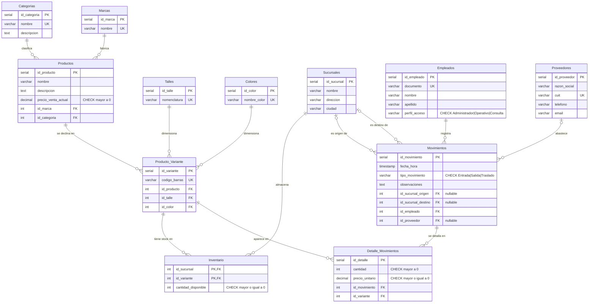

# Proyecto Integrador BD — Gestión de stock para retail deportivo

Base de datos relacional en **PostgreSQL** para una cadena de indumentaria deportiva con múltiples sucursales. Cubre el ciclo completo del inventario: ingreso de mercadería desde proveedores, traslados entre sucursales y venta al público, con control de stock por variante (producto + talle + color).

Proyecto integrador de la cátedra de Base de Datos — Ingeniería en Informática, Facultad de Tecnología y Cs. Aplicadas, U.N.Ca.

---

## Modelo de datos

Doce tablas normalizadas hasta 3FN:



| Grupo | Tablas |
|---|---|
| Catálogos | `Categorias`, `Marcas`, `Talles`, `Colores` |
| Organización | `Proveedores`, `Sucursales`, `Empleados` |
| Producto | `Productos`, `Producto_Variante` |
| Operación | `Inventario`, `Movimientos`, `Detalle_Movimientos` |

La decisión central del diseño es la separación entre **producto** y **variante**. En indumentaria, una misma remera existe en varias combinaciones de talle y color, y cada combinación tiene su propio stock. `Productos` guarda lo conceptual (nombre, descripción, marca, categoría, precio) y `Producto_Variante` cada artículo físico concreto. `Inventario` se lleva a nivel de variante y sucursal, lo que permite saber exactamente qué hay disponible y dónde.

Los movimientos (entrada, traslado, venta) se registran con cabecera y detalle, de modo que el historial logístico queda completo y auditable.

Los diagramas y el diseño técnico están en [`Documentacion/`](Documentacion/).

---

## Estructura del repositorio

```
docker-compose.yml  PostgreSQL 16 en contenedor
setup.sh            Levanta el contenedor y ejecuta los scripts en orden
ScriptSQL/          Scripts numerados, se ejecutan en orden
Datos/              Generadores en Python y datos masivos
Pruebas/            Casos de prueba y evidencias de rendimiento
Documentacion/      Modelo conceptual, diagrama relacional, diseño técnico
Videos Defensa/     Enlace al video de defensa
```

### Scripts SQL

| Archivo | Contenido |
|---|---|
| `01_Creacion_Estructura.sql` | Creación de las doce tablas |
| `02_Restricciones.sql` | Claves foráneas, dominios, integridad referencial |
| `03_Carga_Datos.sql` | Carga inicial de catálogos y datos de prueba |
| `04_Consultas_Reportes.sql` | Consultas de negocio y reportes |
| `05_Indices.sql` | Índices de optimización |
| `06_Seguridad_Roles.sql` | Roles, permisos y vistas |
| `07_Funciones_Procedimientos.sql` | Funciones, procedimientos y triggers en PL/pgSQL |
| `08_Concurrencia.sql` | Manejo de transacciones y concurrencia |

---

## Cómo ejecutarlo

### Con Docker (recomendado)

**Requisitos:** Docker con el plugin Compose. No hace falta tener PostgreSQL instalado.

```bash
./setup.sh
```

`docker-compose.yml` levanta un contenedor `postgres:16` con la base `proyecto_bd` (usuario y contraseña `postgres`, puerto `5432`) y monta `ScriptSQL/` y `Datos/` en `/proyecto` dentro del contenedor. `setup.sh` espera a que la base esté sana y ejecuta con el `psql` del contenedor, en orden, la creación de estructura, las restricciones, la carga de datos, los índices, los roles y las funciones. Cada script corre con `ON_ERROR_STOP` y el proceso aborta ante el primer error, indicando qué script falló.

Por defecto carga los datos de prueba de `03_Carga_Datos.sql`. Para usar el dataset generado con pandas:

```bash
CARGA=masiva ./setup.sh
```

Los dos scripts de datos son alternativos, no complementarios: ambos insertan los catálogos con los mismos ids, así que se ejecuta uno u otro. `03_Carga_Datos.sql` deja además el inventario cargado; `Carga_Masiva.sql` no genera inventario.

Comandos útiles:

```bash
docker compose exec db psql -U postgres -d proyecto_bd   # abrir una consola psql
docker compose down -v && ./setup.sh                    # empezar de cero
DB_PORT=5433 ./setup.sh                                 # si el 5432 está ocupado
```

### Sin Docker

**Requisitos:** PostgreSQL 14 o superior. Para regenerar los datos masivos, Python 3 con `pandas` y `numpy`.

```bash
createdb proyecto_bd

psql -d proyecto_bd -f ScriptSQL/01_Creacion_Estructura.sql
psql -d proyecto_bd -f ScriptSQL/02_Restricciones.sql
psql -d proyecto_bd -f ScriptSQL/03_Carga_Datos.sql      # o Datos/Carga_Masiva.sql
psql -d proyecto_bd -f ScriptSQL/05_Indices.sql
psql -d proyecto_bd -f ScriptSQL/06_Seguridad_Roles.sql
psql -d proyecto_bd -f ScriptSQL/07_Funciones_Procedimientos.sql
```

El orden importa: las restricciones dependen de las tablas, la carga de datos de los catálogos, y los índices conviene crearlos después de cargar los datos.

Una vez cargado, `04_Consultas_Reportes.sql` y `08_Concurrencia.sql` contienen consultas y escenarios para ejecutar de forma interactiva.

---

## Generación de datos masivos

Evaluar el rendimiento con veinte filas no dice nada, así que los datos de prueba se generan por programa en lugar de escribirse a mano.

**`Datos/generar_masivos.py`** produce un catálogo de 1.000 productos con nombres, descripciones y precios plausibles, y lo exporta a `productos_masivos.csv`.

**`Datos/generador_datos.py`** arma el resto del universo de datos con pandas y numpy, respetando las dependencias entre tablas: primero los catálogos, después sucursales y empleados, después las variantes cruzando productos con talles y colores, y por último los movimientos con sus detalles. La salida es `Carga_Masiva.sql`, un script de más de 4.000 líneas listo para ejecutar.

El punto de hacerlo así es que las claves foráneas cierren: cada movimiento apunta a un empleado y una sucursal que existen, cada detalle a una variante real. Generar los datos a mano con ese nivel de consistencia es inviable.

```bash
cd Datos
python generar_masivos.py
python generador_datos.py
```

---

## Rendimiento

Evaluar con veinte filas no dice nada, así que las consultas de `04_Consultas_Reportes.sql` se midieron sobre el dataset de `Datos/Carga_Masiva.sql` (1.000 movimientos, 3.047 detalles, 48 variantes, 362 salidas) en dos escenarios: la base recién cargada sin `05_Indices.sql`, y la misma base con los once índices aplicados. Cada consulta se ejecutó tres veces con `EXPLAIN ANALYZE` y se tomó el mejor tiempo de ejecución, para descartar el efecto de caché fría. Se hizo `ANALYZE` antes de cada escenario.

Entorno: PostgreSQL 16.15 en Docker, levantado con `CARGA=masiva ./setup.sh`, medido el 4 de septiembre de 2026.

| # | Consulta | Sin índices (ms) | Con índices (ms) | Mejora | Índice nuevo que usó el planificador |
|---|---|---|---|---|---|
| 1 | Recaudación por marca, salidas del último trimestre | 1.089 | 0.586 | +46 % | `idx_movimientos_tipo_fecha` |
| 2 | Variantes sin salidas en el año | 1.158 | 0.466 | +60 % | `idx_detalle_movimientos_id_mov` |
| 3 | Tickets y recaudación por empleado en Sucursal NOA | 0.779 | 0.652 | +16 % | `idx_detalle_movimientos_id_mov` |
| 4 | Variantes con stock bajo | 0.096 | 0.098 | -2 % | ninguno, sigue con Seq Scan |
| 5 | Ventas por marca y sucursal | 1.063 | 1.053 | +1 % | ninguno, sigue con Seq Scan |

Con este volumen las consultas ya corren en torno al milisegundo, así que la mejora se ve más en el plan que en el reloj. Las dos que más ganan son la 1, donde el índice compuesto por tipo y fecha reemplaza el recorrido secuencial de `Movimientos` por un Bitmap Index Scan, y la 2, donde el índice sobre la clave foránea de `Detalle_Movimientos` permite resolver el join de la subconsulta con un Index Scan.

En la 5 el planificador sigue eligiendo Seq Scan aun con los índices disponibles: el filtro por tipo `Salida` sin acotar fecha abarca más de un tercio de `Movimientos`, y para esa selectividad recorrer la tabla es más barato que ir al índice. La 4 no cambia porque en este dataset `Inventario` está vacío (`Carga_Masiva.sql` no genera inventario), así que la consulta devuelve cero filas en ambos escenarios.

Los índices se justifican por la forma de los planes más que por los milisegundos: a medida que crezcan `Movimientos` y `Detalle_Movimientos`, el costo de los recorridos secuenciales escala linealmente y el de los accesos por índice no. Las capturas de las mediciones originales están en [`Pruebas/Evidencias_Rendimiento/`](Pruebas/Evidencias_Rendimiento/).

---

## Seguridad

Tres roles bajo el principio de mínimo privilegio:

| Rol | Permisos |
|---|---|
| `rol_administrador` | Acceso completo a estructura y datos |
| `rol_operativo` | Operaciones del día a día: altas de movimientos, consultas de stock |
| `rol_consulta` | Solo lectura, a través de vistas |

Dos vistas complementan el esquema: `vista_stock_simplificado`, que expone el inventario sin datos sensibles, y `vista_auditoria_movimientos`, para seguimiento del historial.

---

## Lógica de negocio

La lógica crítica vive en la base de datos, no en la aplicación, para que se cumpla sin importar quién escriba.

**Procedimientos:**

- `sp_registrar_entrada_mercaderia` — ingreso desde proveedor
- `sp_registrar_traslado_sucursales` — movimiento entre sucursales
- `sp_registrar_venta_caja` — venta al público
- `sp_actualizar_precios_por_marca` — actualización masiva de precios

**Funciones y triggers:**

- `fn_actualizar_inventario_por_movimiento` / `trg_actualizar_stock_automatico` — el stock se ajusta solo al registrar un movimiento
- `fn_validar_stock_disponible` / `trg_validar_stock_antes_insertar` — impide vender o trasladar más de lo que hay
- `fn_autocompletar_precio_unitario` / `trg_autocompletar_precio_detalle` — toma el precio vigente del producto al armar el detalle

---

## Concurrencia

`08_Concurrencia.sql` y `Pruebas/Casos_Prueba/Prueba_Transacciones.sql` plantean escenarios con sesiones simultáneas operando sobre el mismo inventario, con `COMMIT` y `ROLLBACK` explícitos, para verificar que dos ventas concurrentes de la última unidad no dejen el stock en negativo.

---

## Defensa

[Video de defensa del proyecto](https://drive.google.com/drive/folders/1edLRO5p9XRerZa9qQGLjj95CrNs00Ym1?usp=sharing)

---

## Mi rol en el proyecto

Trabajo grupal de seis integrantes. Lo que sigue es lo que escribí yo, verificable con `git log` y `git blame`.

**Diseño del esquema.** El modelo de datos completo: `01_Creacion_Estructura.sql` y `02_Restricciones.sql` — las doce tablas, la separación producto/variante, las claves primarias y foráneas con sus políticas `ON DELETE`/`ON UPDATE`, y las restricciones `UNIQUE` y `CHECK`. También el modelo conceptual y el diagrama relacional de `Documentacion/`.

**Roles y permisos.** `06_Seguridad_Roles.sql`: los tres roles bajo mínimo privilegio y las dos vistas.

**Generación de datos masivos.** `Datos/generar_masivos.py` y `Datos/generador_datos.py`, los dos scripts en Python que producen `Carga_Masiva.sql` respetando las dependencias entre tablas.

**Reproducibilidad.** `docker-compose.yml` y `setup.sh`, para que el proyecto se levante con un comando en lugar de seis `psql` manuales.

**Documentación.** El README en su forma actual, incluida la medición comparativa de consultas con y sin índices sobre el dataset masivo.

Del resto del equipo: la carga de datos de prueba (`03_Carga_Datos.sql`) y la concurrencia (`08_Concurrencia.sql`), de Quintero; las consultas y reportes (`04_Consultas_Reportes.sql`), las funciones y triggers en PL/pgSQL (`07_Funciones_Procedimientos.sql`) y las pruebas de transacciones, de Escalante; los índices (`05_Indices.sql`) y las mediciones de la Etapa III, de Yapura.

---

## Equipo

| Integrante |
|---|
| Gallo, Juan Agustín |
| Escalante, Judith Griselda |
| Yapura Fuenzalida, Víctor |
| Bravo, Nicolás |
| Máximo, Joaquín |
| Quintero, Facundo Joel |
